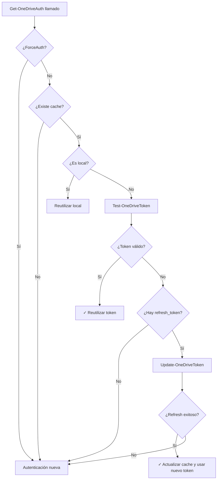

# Sistema de Caché de Tokens OneDrive

## Descripción General

El sistema ahora mantiene en caché las autenticaciones de OneDrive durante la sesión actual de PowerShell. Esto evita que el usuario tenga que volver a autenticarse cada vez que selecciona OneDrive en el menú.

## Comportamiento

### Antes de la Implementación
1. Usuario selecciona OneDrive como Origen
2. Se autentica con Microsoft
3. Usuario se arrepiente, vuelve al menú
4. Usuario vuelve a seleccionar OneDrive
5. ❌ Se fuerza nueva autenticación aunque el token siga siendo válido

### Después de la Implementación
1. Usuario selecciona OneDrive como Origen
2. Se autentica con Microsoft (primera vez)
3. **Token guardado en `$Global:OneDriveSessionAuth`**
4. Usuario se arrepiente, vuelve al menú
5. Usuario vuelve a seleccionar OneDrive
6. ✅ Se reutiliza el token existente si sigue siendo válido
7. ✅ Se refresca automáticamente si expiró (usando `refresh_token`)
8. ⚠ Solo se pide nueva autenticación si el refresh falla

## Variables de Caché

### `$Global:OneDriveSessionAuth`
Hashtable con la siguiente estructura:

```powershell
@{
    Email        = "usuario@outlook.com"
    Token        = "eyJ0eXAiOiJKV1QiLCJub..."  # access_token
    RefreshToken = "M.R3_BAY..."                 # refresh_token para renovar
    ApiUrl       = "https://graph.microsoft.com/v1.0/me/drive"
    LocalPath    = $null                         # o ruta local si se usa OneDrive local
    UseLocal     = $false                        # $true si se usa OneDrive local
    DriveId      = "b!abc123..."
    RootId       = "01ABC..."
}
```

Esta variable persiste **solo durante la sesión de PowerShell**. Se borra al cerrar la consola.

## Lógica de Validación

### Flujo en `Get-OneDriveAuth`



## Funciones Modificadas

### `Get-OneDriveAuth`
**Cambios:**
- Nuevo parámetro: `-ForceAuth` (switch)
- Verificación de `$Global:OneDriveSessionAuth` al inicio
- Validación automática con `Test-OneDriveToken`
- Refresh automático con `Update-OneDriveToken` si expira
- Guardado automático en cache al final

**Mensajes de consola:**
```
✓ Usando token OneDrive cacheado (aún válido)
✓ Token OneDrive refrescado automáticamente
✓ Usando autenticación OneDrive local cacheada
```

### Uso de `-ForceAuth`

Si se necesita forzar una nueva autenticación ignorando el cache:

```powershell
$auth = Get-OneDriveAuth -ForceAuth
```

## Casos de Uso

### Caso 1: Primera Autenticación
1. Usuario selecciona OneDrive (primera vez en la sesión)
2. `$Global:OneDriveSessionAuth` no existe
3. Se ejecuta autenticación completa con Device Code Flow
4. Token guardado en cache

### Caso 2: Segunda Selección (Token Válido)
1. Usuario selecciona OneDrive otra vez
2. `$Global:OneDriveSessionAuth` existe
3. `Test-OneDriveToken` devuelve `$true`
4. Se reutiliza token sin pedir autenticación
5. Usuario solo elige la carpeta

### Caso 3: Token Expirado pero Refrescable
1. Usuario selecciona OneDrive después de tiempo
2. `$Global:OneDriveSessionAuth` existe
3. `Test-OneDriveToken` devuelve `$false`
4. `Update-OneDriveToken` ejecutado automáticamente
5. Si tiene éxito, cache actualizado y continúa
6. Si falla, se pide nueva autenticación

### Caso 4: OneDrive Local
1. Usuario elige "OneDrive Local" en vez de API
2. `UseLocal = $true` guardado en cache
3. En siguientes selecciones, se reutiliza inmediatamente
4. No se valida token (no es necesario para rutas locales)

## Beneficios

✅ **Experiencia de usuario mejorada**: No se pide autenticación repetida  
✅ **Rendimiento**: Evita llamadas innecesarias a Microsoft Graph API  
✅ **Transparencia**: Mensajes claros sobre qué se está haciendo  
✅ **Robustez**: Refresh automático ante tokens expirados  
✅ **Flexibilidad**: Opción `-ForceAuth` disponible si se necesita  

## Limitaciones

⚠ El cache solo persiste durante la sesión de PowerShell actual  
⚠ No se persiste en disco (seguridad: evitar tokens en texto plano)  
⚠ Si se cierra la consola, hay que autenticar de nuevo  

## Consideraciones de Seguridad

- Los tokens OAuth **no se guardan en archivos**
- Solo existen en memoria durante la sesión
- Se limpian automáticamente al cerrar PowerShell
- Los tokens tienen expiración corta (1 hora típicamente)
- Los refresh tokens se usan para renovar sin pedir credenciales

## Testing

Para probar el sistema:

```powershell
# Test 1: Primera autenticación
.\Llevar.ps1 -Interactive
# Seleccionar Origen → OneDrive → Autenticar → Elegir carpeta

# Test 2: Volver y re-seleccionar
# Volver → Seleccionar Origen → OneDrive
# Debe decir: "✓ Usando token OneDrive cacheado (aún válido)"

# Test 3: Forzar nueva autenticación
$auth = Get-OneDriveAuth -ForceAuth
```

## Logs Relacionados

Los siguientes mensajes aparecen en el log:

```
INFO: Verificando token OneDrive en cache de sesión...
INFO: Token OneDrive reutilizado desde cache (Email: usuario@outlook.com)
INFO: Token en cache expiró, intentando refrescar...
INFO: Token OneDrive refrescado exitosamente
INFO: Token OneDrive guardado en cache de sesión
WARNING: No se pudo refrescar token, requiere nueva autenticación
```

## Ver También

- [OneDriveAuth.psm1](../Modules/Transfer/OneDrive/OneDriveAuth.psm1) - Implementación del cache
- [Test-OneDriveToken](../Modules/Transfer/OneDrive/OneDriveAuth.psm1#L90) - Validación de tokens
- [Update-OneDriveToken](../Modules/Transfer/OneDrive/OneDriveAuth.psm1#L23) - Refresh de tokens
